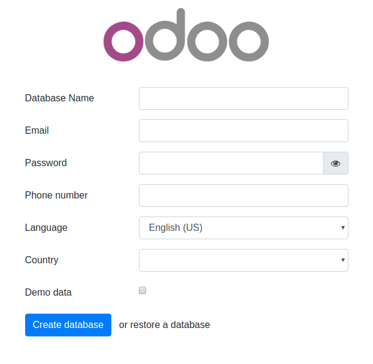
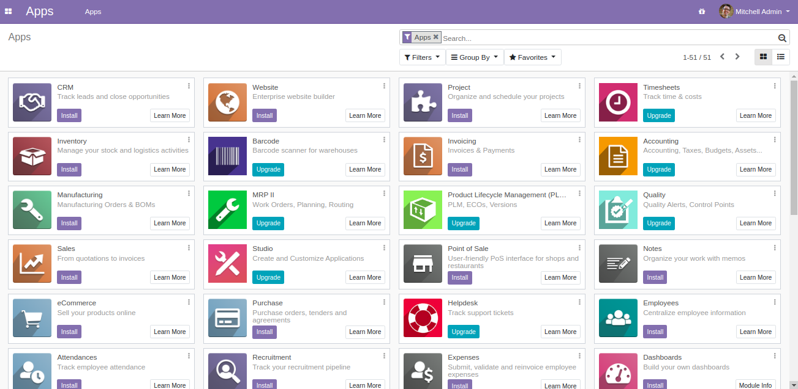

# Instructions

Give full permission to the folders so that the containers can access the directory and files.```
$ sudo chmod -R 777 addons
$ sudo chmod -R 777 etc
```

To start the container:
```
$ docker-compose up
```

* Then open `localhost:8069` to access Odoo 13.0. You can change the port number for the application in the docker-compose file if you want.

```
ports:
 - "8069:8069"
```

# Custom addons

The **addons** folder contains custom addons. We can add our custom module to this addons folder to add into the apps section.


# docker-compose.yml

* odoo:13.0
* postgres:12

# Odoo 13 screenshots




